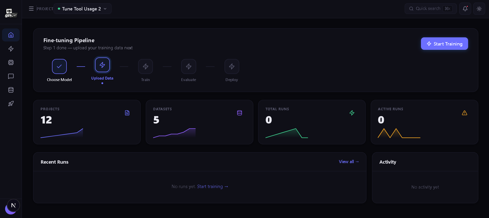
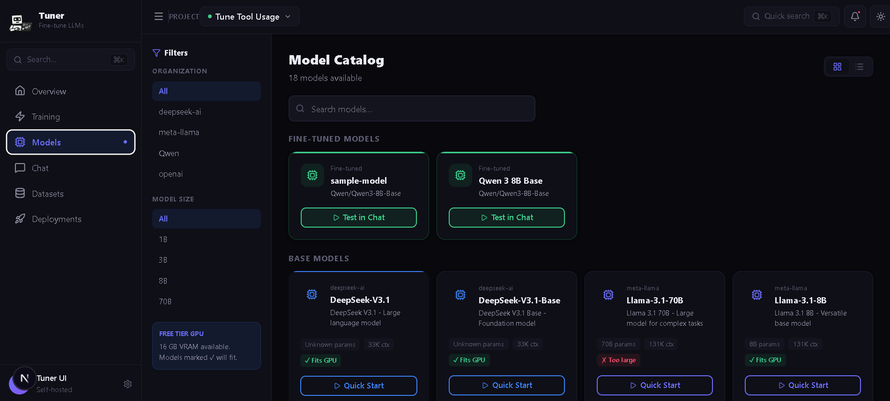
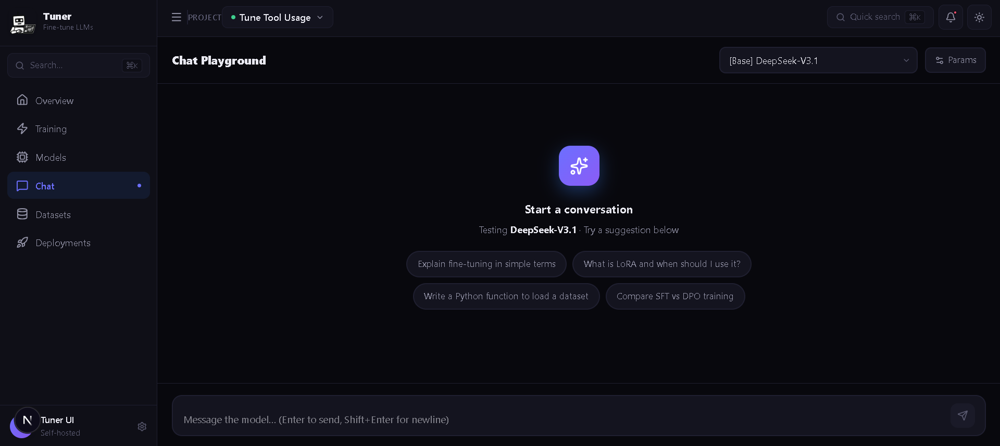
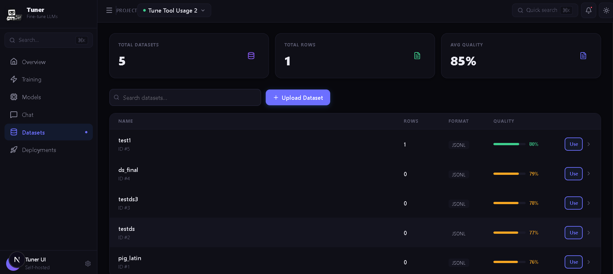

<div align="center">
  
  <h1>Tuner UI</h1>
  <p><em>A full-stack platform for fine-tuning and training AI models — modern web UI, powerful backend API.</em></p>

  
  
  
  
  
</div>

---

## 🚨 Vibe Code Alert
This project was 99% vibe coded as a fun Saturday hack to explore the Tinker Cookbook and see how quickly a full-featured training platform could be built. The result? A functional web UI that makes fine-tuning LLMs as easy as clicking a few buttons.

## Demo Video
Watch the complete demo: https://www.youtube.com/watch?v=qdnSWMPZri8

---

## Screenshots

**Dashboard — Fine-tuning Pipeline Overview**


**Model Catalog — Browse & Filter Models**


**Chat Playground — Test Your Models**


**Dataset Manager — Upload & Manage Training Data**


---

## Features

### 🎯 Model Training
- **Multi-Model Support**: Llama, Qwen, DeepSeek architectures
- **Training Recipes**: SFT, DPO, RL, Distillation, Chat SL, Math RL, On-Policy Distillation
- **LoRA Fine-tuning**: Efficient parameter-efficient training
- **Real-time Monitoring**: Live progress tracking with metrics
- **Auto Hyperparameters**: Intelligent parameter suggestions based on model size

### 📊 Dataset Management
- **JSONL Upload**: Direct dataset file upload with validation
- **HuggingFace Integration**: Seamless dataset importing
- **Data Preview**: Interactive dataset exploration
- **Format Conversion**: Support for Alpaca and multi-turn conversation formats
- **Quality Scoring**: Automatic dataset quality detection

### 💬 Model Testing & Chat
- **Chat Playground**: Test models with real-time conversations
- **Model Selector**: Switch between base and fine-tuned models
- **Inference Params**: Control temperature, top-p, max tokens
- **Checkpoint Downloads**: Export trained model weights

### 🚀 HuggingFace Deployment
- **One-Click Deploy**: Deploy trained models to HuggingFace Hub
- **Secure Token Management**: Encrypted HuggingFace API token storage
- **Auto Model Cards**: Automatically generated model cards with training details
- **Public/Private Repos**: Choose repository visibility
- **LoRA Weight Merging**: Option to merge LoRA weights with base model

### 🗂️ Project Organization
- **Workspace Management**: Project-based organization
- **Run History**: Complete training run tracking
- **Model Registry**: Versioned model catalog
- **Metrics & Logs**: Detailed training metrics and logs
- **Cost Estimation**: Training cost calculations

---

## Prerequisites

- **Python** 3.11+ — [Download](https://python.org/)
- **Node.js** 18+ — [Download](https://nodejs.org/)
- **pnpm** — `npm install -g pnpm`

---

## Quick Start

### 1. Clone & Configure
```bash
git clone https://github.com/klei30/tuner-ui.git
cd tuner-ui

# Backend config
cp backend/.env.example backend/.env
# Edit backend/.env — add your TINKER_API_KEY

# Frontend config
cp frontend/.env.example frontend/.env.local
```

### 2. Setup Backend
```bash
cd backend
python -m venv .venv

# Windows
.venv\Scripts\activate
# macOS/Linux
source .venv/bin/activate

pip install -r requirements.txt
```

### 3. Setup Frontend
```bash
cd ../frontend
pnpm install
```

### 4. Run (2 terminals)
```bash
# Terminal 1 — Backend
cd backend
uvicorn main:app --reload --port 8000

# Terminal 2 — Frontend
cd frontend
pnpm dev
```

Open **http://localhost:3000**

---

## Docker (Infrastructure Only)

Start PostgreSQL + Redis for local development:

```bash
docker-compose -f docker-compose.dev.yml up -d
```

---

## Configuration

### Backend (`backend/.env`)
```bash
TINKER_API_KEY=your_tinker_api_key    # Required
DATABASE_URL=sqlite:///./tuner_ui.db  # SQLite for dev
ALLOW_ANON=true
ENCRYPTION_KEY=your_fernet_key        # Generate below
```

### Frontend (`frontend/.env.local`)
```bash
NEXT_PUBLIC_API_BASE_URL=http://127.0.0.1:8000
NEXT_PUBLIC_TINKER_API_KEY=your_tinker_api_key
```

### Generate Encryption Key
```bash
python -c "from cryptography.fernet import Fernet; print(Fernet.generate_key().decode())"
```

---

## HuggingFace Deployment

1. Generate an encryption key and add it to `backend/.env`
2. Get a HuggingFace token with **write** permissions from https://huggingface.co/settings/tokens
3. Go to **Settings** in the UI and paste your token
4. After a training run, click **Deploy to HuggingFace** on any checkpoint

---

## Project Structure

```
tuner-ui/
├── backend/                 # FastAPI backend
│   ├── main.py             # API application
│   ├── models.py           # Database models
│   ├── job_runner.py       # Training job execution
│   ├── alembic/            # Database migrations
│   └── .env.example
├── frontend/               # Next.js frontend
│   ├── app/                # Next.js pages
│   ├── components/         # UI components
│   ├── lib/api.ts          # API client
│   └── .env.example
├── docker-compose.yml
├── docker-compose.dev.yml
└── docs/
```

---

## Technology Stack

| Layer | Tech |
|---|---|
| Frontend | Next.js 15, React 19, TypeScript |
| Backend | FastAPI, SQLAlchemy, Pydantic |
| Database | SQLite (dev) / PostgreSQL (prod) |
| ML/Training | Tinker Cookbook, HuggingFace, LoRA |
| Linting | Ruff (Python), ESLint (TS) |

---

## Troubleshooting

**Port already in use** — Change `--port 8001` in uvicorn, update `NEXT_PUBLIC_API_BASE_URL`

**Frontend fails to fetch** — Check `NEXT_PUBLIC_API_BASE_URL` matches backend URL, use `127.0.0.1` not `localhost`

**Backend import errors** — Ensure venv is active: `pip install -r requirements.txt`. Tinker is an optional internal dependency.

**Frontend compilation errors** — `rm -rf .next && pnpm dev`

---

## Contributing

1. Fork the repo
2. Create a branch: `git checkout -b feature/your-feature`
3. Commit your changes
4. Open a Pull Request

See [CONTRIBUTING.md](CONTRIBUTING.md) for details.

---

<div align="center">
  <p>Made with ❤️ by the community</p>
  <p>
    <a href="https://github.com/klei30/tuner-ui/issues">Report Bug</a>
    ·
    <a href="https://github.com/klei30/tuner-ui/issues">Request Feature</a>
  </p>
</div>
